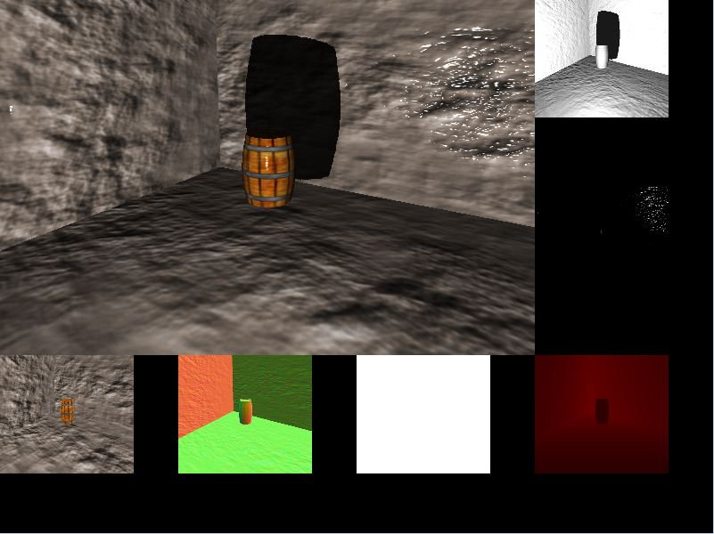
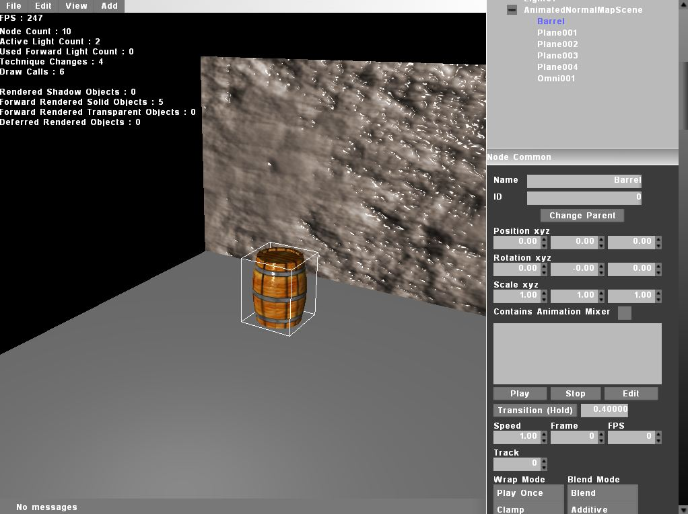
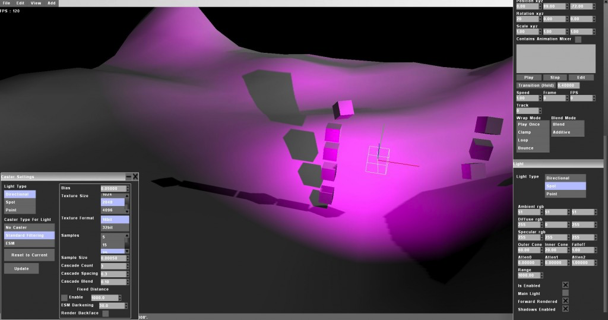
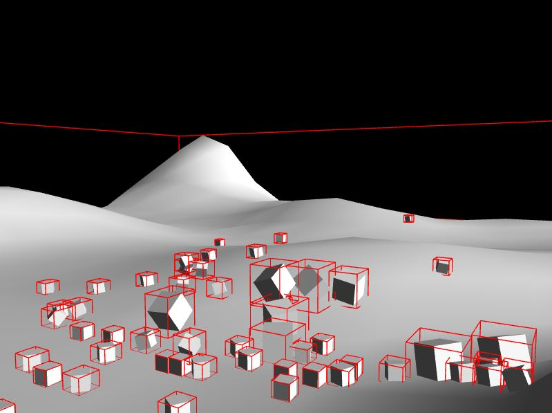
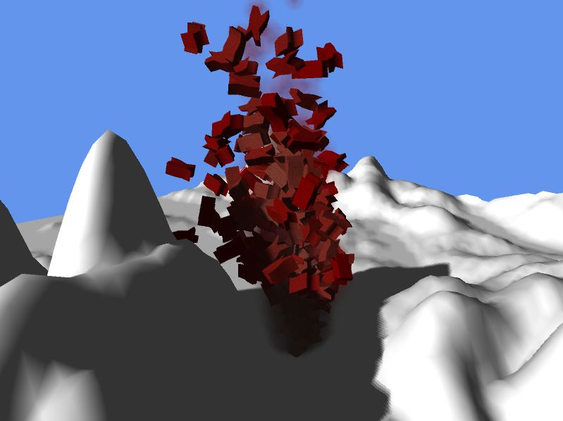
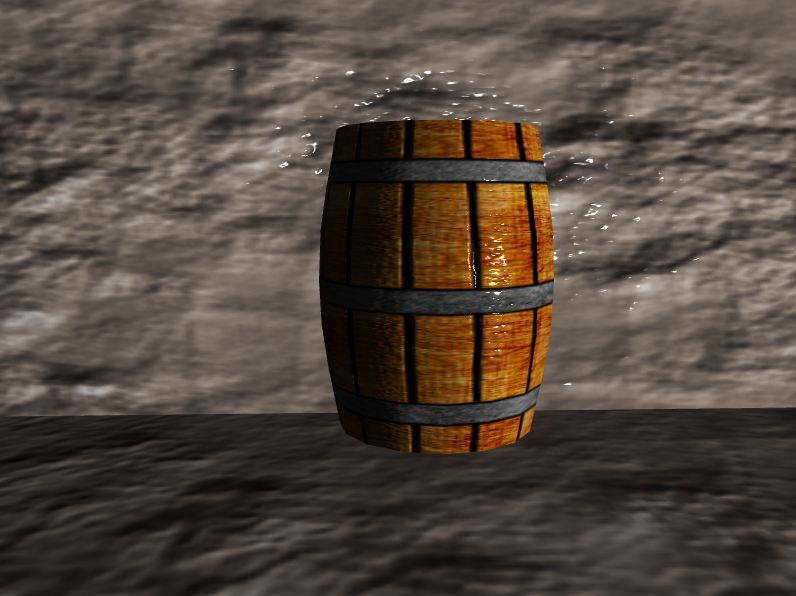

# Mash #

Mash is a cross-platform, realtime, 3D engine written in C++ for games and simulation development. The engine currently runs on Windows, Mac and Ubuntu and supports DirectX and OpenGL. Mash can simplify and reduce the workload of cross-platform development by allowing you to write your shaders once and compile them to your target platform(s).

The repositiory contains no make files. It is here for historical and reference purposes only. 

### Features ###

* Support for Windows, Mac and Ubuntu 13.04
* Written in C++.
* Support for DirectX 10.1 or greater.
* Support for OpenGL 3.2 or greater. (From 3.1 on Ubuntu)
* Cross-platform. Write your code once then compile it on Windows, Mac or Ubuntu.
* A custom shader system which supports a write once compile anywhere philosophy. Shaders are written in hlsl shader model 3 style code and are compiled to either hlsl or glsl. This system is flexible enough however to allow you to write native shader code in hlsl or glsl and compile it to a target shader profile. This enables you to target a gpu for special cases or simply push the gpu to its limit.
* The shader system also takes care of the lighting for you. Your shaders will be adjusted at runtime to reflect lighting changes as they happen.
* Choice of forward or deferred rendering. This can lead to performance increases in simple scenes.
* Customize how shadows are produced.
* Customize the way a surface is shaded by lights. No more shiny everything!
* Ability to batch render objects using HW instancing or by any other custom method.
* Supports the COLLADA file format.
* Character animations via skinning. Nodes such as lights and cameras can also be animated for automated movement.
* Scripts written in LUA can be attached to scene objects to customize their behaviors.
* Integrated XML parser.
* Integrated physics using bullet physics.
* Input system that maps events to actions. An example would be to bind the space bar, mouse button 1, and a game pads right trigger to all trigger the fire action.
* Supports joysticks and Xbox 360 controllers. (Windows and Ubuntu only)
* Integrated GUI system.

### Can I use this in my projects? ###

Yes. It is covered under the MIT License

### Getting started ###

See Doc/MashManual.html in the repository for instructions and examples

### Pictures ###

